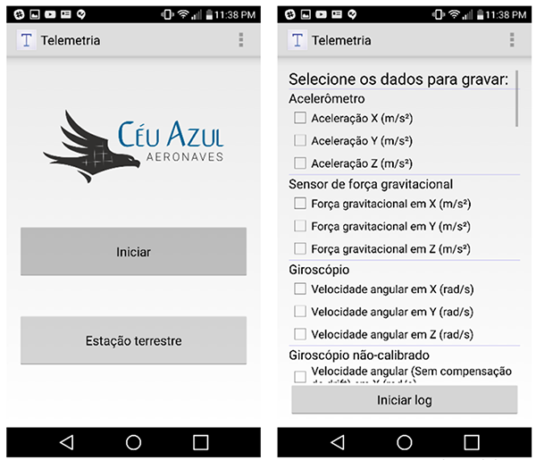

# Telemetry
### : Android's app for data aquisition

  

### [Paper](https://arxiv.org/abs/1907.10830) 

The results of the paper came from the **Tensorflow code**

> **Smartphone: Uma alternativa acessível para aquisição de dados em VANTs** 
> **Leonardo Mariga (UFSC)**, Rafael Araújo Lehmkuhl (UFSC), Prof. Amir Antonio Martins Oliveira Jr., Ph.D. (UFSC)
>
> **Abstract** *Os smartphones possuem uma grande variedade de sensores, como GPS, giroscópio, acelerômetro, magnetômetro e barômetro, que são utilizados no dia-a-dia para orientação, localização e conforto de seu usuário. Este trabalho descreve o desenvolvimento de um aplicativo para sistema Android a ser utilizado como plataforma de aquisição de dados em VANTs. É feita uma descrição detalhada do software desenvolvido, seguida pela análise de dados obtidos em testes. Avalia-se também o desempenho do sistema, comparando-o a outros sistemas de aquisição em termos de precisão e velocidade. Por fim é mostrado resultados da equipe Céu Azul Aeronaves na utilização deste sistema como auxilio no projeto de suas aeronaves.* (traduzir depois)

## How to contribute

- Fork the project
- Open Android Studio
- Select Check out project from Version Control
- Select the project from your respositories list (make sure you have logged onto Android Studio's Github integration)
